Развернуть базу на мастере и настроить так, чтобы реплицировались таблицы:
| bookmaker |
| competition |
| market |
| odds |
| outcome |

Команда для извлечения текущего пароля root для mysql:
cat /var/log/mysqld.log | grep 'root@localhost:' | awk '{print $11}'

подключаюсь с полученным паролем
mysql -uroot -p'3_0Pf:Py)yU/'

В консоли СУБД задаю свой сильный пароль на обоих серверах запросом в консоли mysql
ALTER USER USER() IDENTIFIED BY 'Qq-123456';
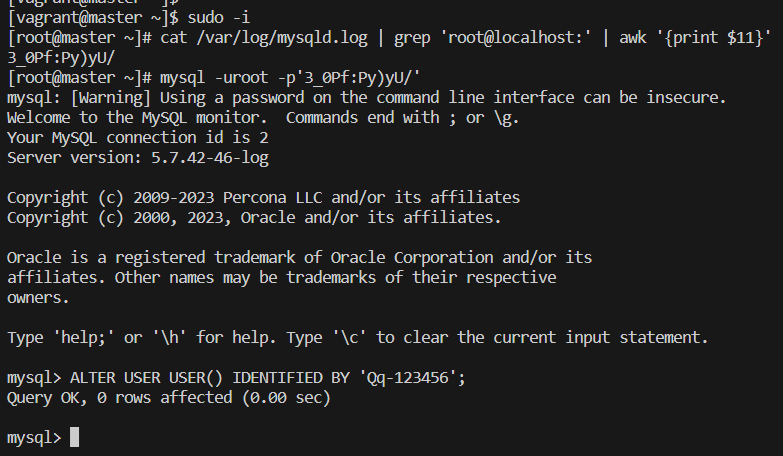</img>

Настройка репликации
mysql -uroot -p'Qq-123456'

убеждаюсь в том, что server-id на мастере и слейве разные, следующим запросом:
select @@server_id;

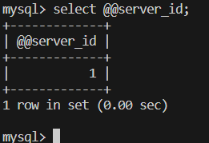</img>
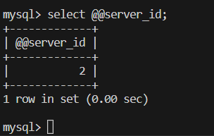</img>

убеждаюсь, что GTID включен
show variables like 'gtid_mode';
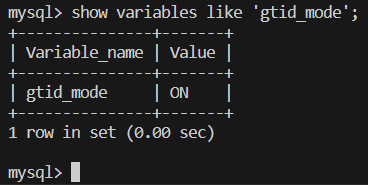</img>

создаю тестовую базу bet:
create database bet;
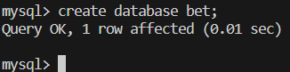</img>

загружаю дамп и проверяю
mysql -uroot -p'Qq-123456' -D bet < /vagrant/bet.dmp
mysql -uroot -p'Qq-123456'
USE bet;
SHOW TABLES;
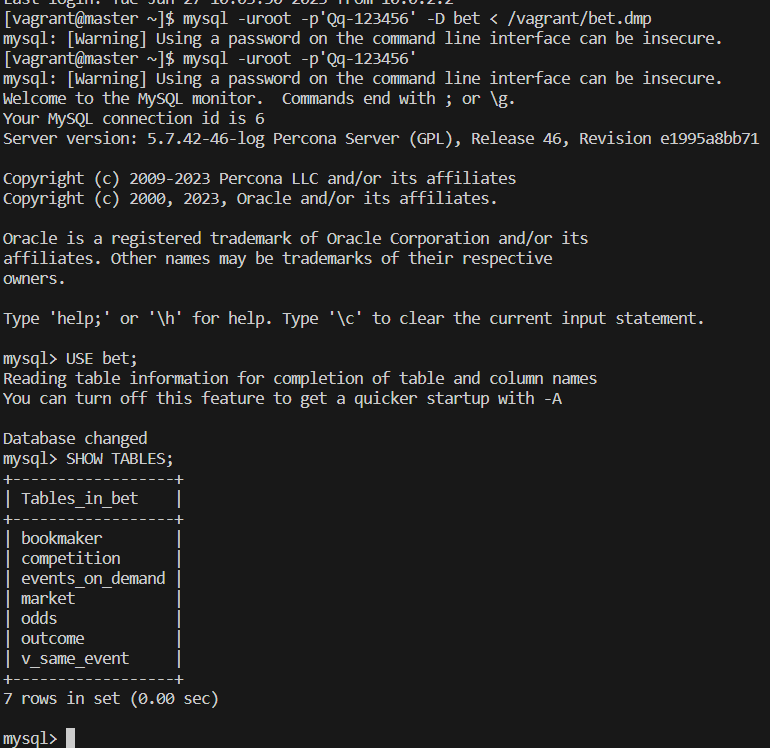</img>

создаю пользователя для репликации repl с паролем !OtusLinux2018 и даю ему права на репликацию:
CREATE USER 'repl'@'%' IDENTIFIED BY '!OtusLinux2018';
SELECT user,host FROM mysql.user where user='repl';
GRANT REPLICATION SLAVE ON *.* TO 'repl'@'%' IDENTIFIED BY '!OtusLinux2018';
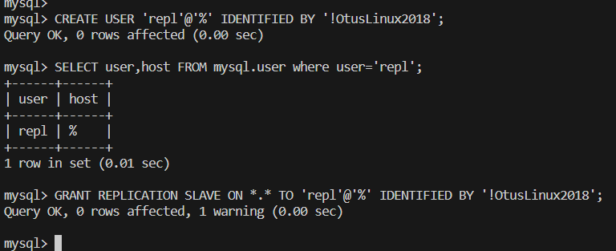</img>
Дамплю базу для последующего залива на слэйв и игнорирурую таблицы по заданию
mysqldump --all-databases --triggers --routines --master-data --ignore-table=bet.events_on_demand --ignore-table=bet.v_same_event -uroot -p > master.sql

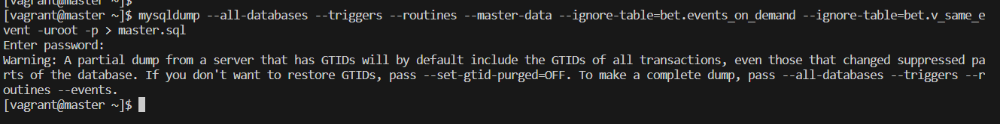</img>

Таблицы bet.events_on_demand и bet.v_same_event при репликации уже игнорируются посредством параметров в файле конфигурации 05-binlog.cnf

захожу на slave подключаюсь к СУБД
mysql -uroot -p'Qq-123456'

заливаю дамп с мастера и проверяю, что база есть и без игнорируемых таблиц
SOURCE /vagrant/master.sql
смотрю базу bet
SHOW DATABASES LIKE 'bet';
подключаюсь к ней
USE bet;
смотрю таблицы в bet
SHOW TABLES;
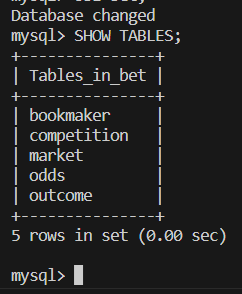</img>

Подключаю и запускаю репликацию на slave следующими запросами:
CHANGE MASTER TO MASTER_HOST = "192.168.56.150", MASTER_PORT = 3306, MASTER_USER = "repl", MASTER_PASSWORD = "!OtusLinux2018", MASTER_AUTO_POSITION = 1;
START SLAVE;
SHOW SLAVE STATUS\G
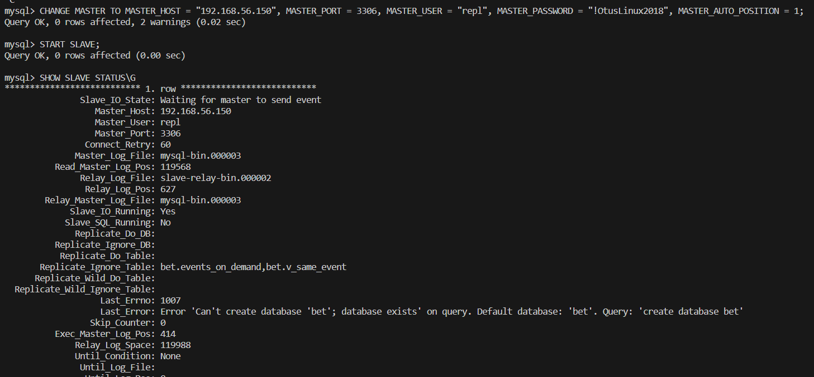</img>

Видно, что gtid и репликация работают, две таблицы bet.events_on_demand и bet.v_same_event игнорируются.

Проверка репликации
на мастере
USE bet;
INSERT INTO bookmaker (id,bookmaker_name) VALUES(1,'bdfbwgwq');
SELECT * FROM bookmaker;
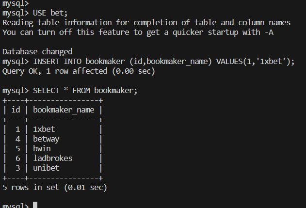</img>

